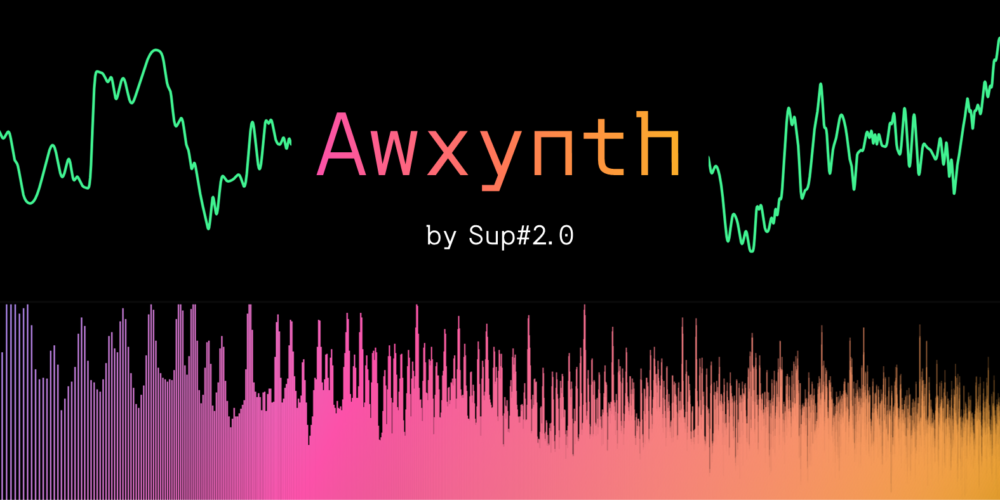

---

*Awxynth* is a **mathematical synthesiser** that lets you use the [Desmos graphing calculator](https://desmos.com/calculator) to create and transform sounds.

If you’ve ever made a cool-looking graph and wondered, “hmm, what would this sound like?”, this is exactly what you’re looking for.

Visit [sup2point0.github.io/awxynth](https://github.com/Sup2point0/awxynth) to use it!

Help, FAQ and tutorials are available via the navbar.

 

## Features

- Virtual piano keyboard for playing notes
- Builtin effects like distortion, compression, detune
- Tons of presets
- Frequency spectrum visualiser
- Straightforward and efficient UI/UX

### Future
- Echo + reverb effects
- Persisted user preferences
- Parameter routing and automation
- Export to external format

 

## About

Built with:
- [Svelte 5](https://svelte.dev) + [SvelteKit](https://svelte.dev/docs/kit)
- [Web Audio API](https://developer.mozilla.org/en-US/docs/Web/API/Web_Audio_API)
- [Desmos Graphing Calculator API](https://www.desmos.com/api/v1.12/docs/index.html)
- [Canvas API](https://developer.mozilla.org/en-US/docs/Web/API/Canvas_API)

Inspired by:
- [Vital](https://vital.audio) (spectral warping wavetable synth)

 

## Contribute

Personal project so I probably won’t take contributions, but if you have a feature request, drop it in [Issues](https://github.com/Sup2point0/awxynth/issues)!

 

## Generative AI

All handcoded and handwritten <3

 

## Licence

- [CC BY-SA 4.0](https://creativecommons.org/licenses/by-sa/4.0/deed.en) for written content under [docs/](docs/)
- [MIT](LICENCE) for everything else
